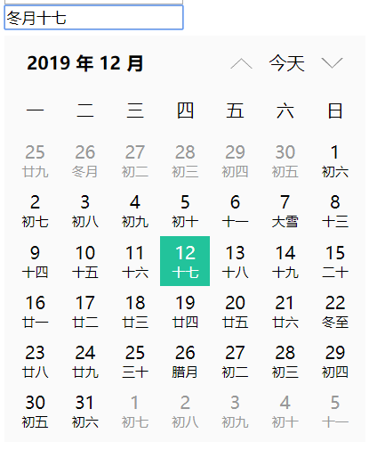

- [安装](#安装)
- [快速上手](#快速上手)
- [Attributes](#Attributes)
- [Events](#Events)
- [日期格式](#日期格式)
- [自定义样式](#自定义样式)
- [截图](#截图)

## 安装
### npm安装
```
npm install vue-calendar-xjq --save
```
### yarn安装
```
yarn add vue-calendar-xjq
```
### CDN
```javascript
<!-- 引入样式 -->
<link rel="stylesheet" href="https://cdn.jsdelivr.net/npm/vue-calendar-xjq@1.1.1/dist/index.css">
<!-- 引入组件 -->
<script src="https://cdn.jsdelivr.net/npm/vue-calendar-xjq@1.1.1/dist/index.js"></script>
```
## 快速上手
```javascript
import Vue from 'vue';
import { Calendar } from 'vue-calendar-xjq';
import 'vue-calendar-xjq/lib/index.css';

Vue.use(Calendar)
```
### Attributes
参数 | 说明 | 类型 | 默认值
-----|------|------|------
el | 绑定的元素的id | string | 
value/v-model | 是否显示组件 | boolean | false
isLunar | 是否显示农历 | boolean | false
hms | 是否添加时间输入 | boolean | false
minDate | 允许的最小日期 (格式：yyyy-MM-DD) | string |
maxDate | 允许的最大日期 (格式：yyyy-MM-DD) | string |
defaultVal | 默认值 | string | 
format | 格式化 | string | yyyy-MM-DD

### Events
事件名称 | 说明 | 回调参数
--------|------|--------
change | 选择日期后触发 | { date: 17, day: 3, formatDate: "2018年01月17日 下午 02:05:15", hour: "14", minute: "5", month: 0, second: "15", year: 2018 }

### 日期格式
格式 | 含义 | 备注 | 举例
-----|------|------|----
yy | 年 | 取年份后两位 | 19
yyyy | 年 | | 2019
M | 月份 | 不补0 | 1
MM | 月份 | 补0 | 01
D | 日 | 不补0 | 1
DD | 日 | 补0 | 01
d | 周 | | 一
dd | 周 | | 周一
ddd | 周 | | 星期一
A | | | 上午
h | 小时 | 12小时制，不补0, 需要和 A 配合使用 | 1
hh | 小时 | 12小时制，补0，需要和A配合使用 | 01
H | 小时 | 24小时制，不补0 | 15
HH | 小时 | 24小时制，补0 | 04
m | 分钟 | 不补0 | 1
mm | 分钟 | 补0 | 01
s | 秒 | 不补0 | 1
ss | 秒 | 补0 | 01
LY | 农历年 | | 2018
LM | 农历月份 | | 腊月
LD | 农历日 | | 十一
LT | 农历节气 | 没有节气的话，则是空字符串 | 冬至

### 自定义样式
#### 步骤一：引入样式
```javascript
import 'vue-calendar-xjq/lib/index.less'
```
#### 步骤二：修改样式变量
```javascript
// 使用Less提供的modifyVars即可对变量进行修改, 下面是webpack的配置
module.exports = {
  rules: [
    {
      test: /\.less$/,
      use: [
        // ...其他 loader 配置
        {
          loader: 'less-loader',
          options: {
            modifyVars: {
              'primary-color': '#22c39b',
            }
          }
        }
      ]
    }
  ]
};
// vue-cli 3 vue.config.js配置如下
module.exports = {
  // ...其他配置
  css: {
    loaderOptions: {
      less:{
        modifyVars: {
          'primary-color': '#efce6f',
        }
      }
    }
  },
}
```
__样式变量__
> 其它样式变量，请参考[配置文件](src/index.less)

## 截图

